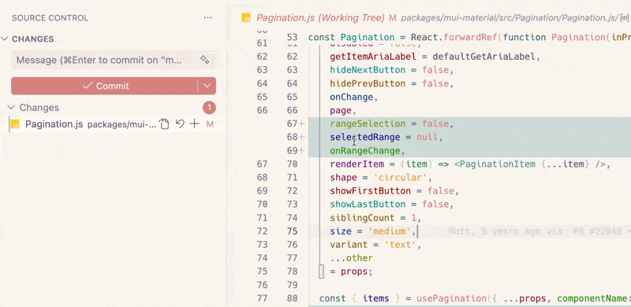
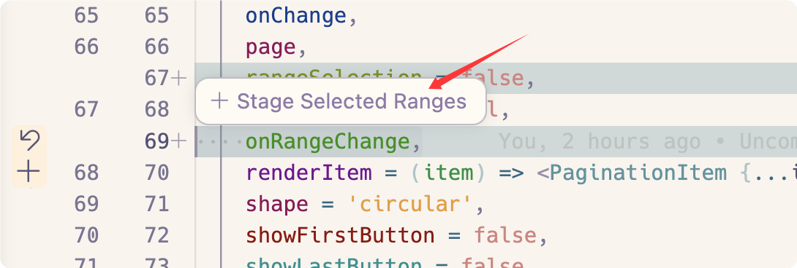

# Stage Selected Ranges Button

Stage selected lines in a Git diff with fewer clicks.

## Preview





## Usage

1. Open a Git diff in VS Code.
2. Select the part of the changed text you want to stage.
3. Wait briefly for the popup to appear.
4. Click `Stage Selected Ranges`.

The extension calls VS Code's built-in `git.stageSelectedRanges` command and leaves normal file selection behavior unchanged outside supported diff contexts.

## Requirements

- VS Code `1.90.0` or later
- built-in Git extension enabled
- a diff context where `Stage Selected Ranges` is actually available

## Install

### From VSIX (Local Testing)

1. Package the extension:

```bash
npm run package:vsix
```

2. Install using one of these methods:

**Method A: VS Code UI**
- Open Extensions panel (`Cmd+Shift+X` / `Ctrl+Shift+X`)
- Click the `...` menu → `Install from VSIX...`
- Select the `.vsix` file

**Method B: Command Line**
```bash
code --install-extension stage-selected-ranges-button-0.0.1.vsix
```

### From Marketplace

[Install from VS Code Marketplace](https://marketplace.visualstudio.com/items?itemName=AlessiaLi.stage-selected-ranges-button)

## Notes

- The popup is anchored near the active end of the selection to reduce overlap with the start of the selection.

## Development

1. Open this folder in VS Code.
2. Press `F5` to launch an Extension Development Host.
3. In the new window, open a Git repository with modified files.
4. Open a diff editor and test the selection flow.

## License

[MIT](./LICENSE)
